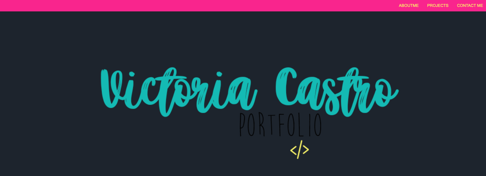
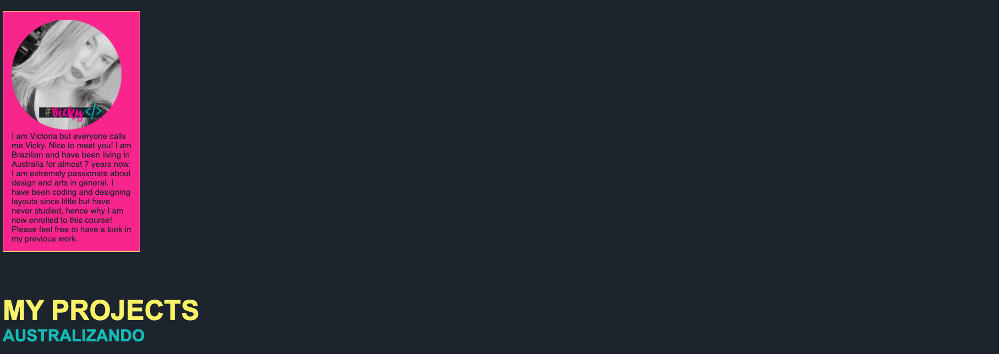
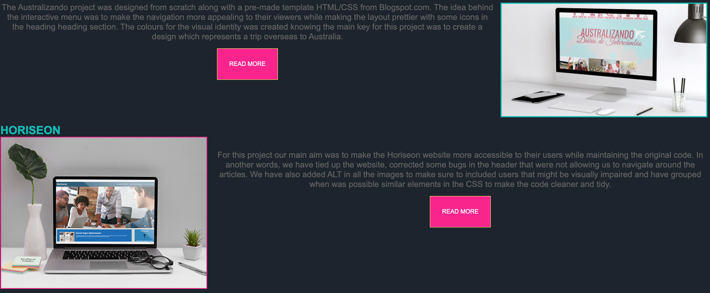
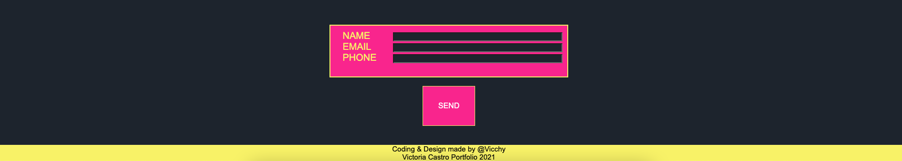

##HOMEWORK2 - Advanced CSS: Portfolio
-----------------------------------
This project is a website to showcase my Portfolio. The code is meant to be friendly to different devices which means all the visual elements such as images, text, navigation bar, footer and form will change position according to the resolution setttings.

It contains: 
- Navigation bar at the top with the "About Me", "Projects" and "Contact Me" options;
- Personalised Header;
- Personalised Profile Picture;
- About me section with a brief description;
- Section to showcase my projects with a description;
- Contact Form at the bottom;

Link to deployed application: https://vicchyx.github.io/vicchys-portfolio-final/

Screenshots of project:

